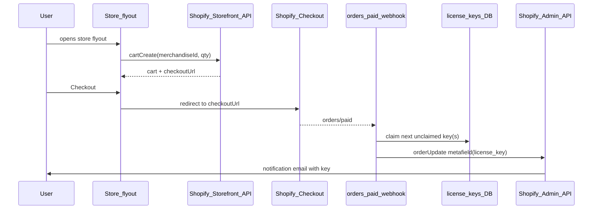

# mDOT preorder store flyout + Shopify fulfillment

## How it works

The menubar gets a **store icon**. Clicking it opens a **flyout panel** that is both the store and the cart. It always shows the mDOT product card (image, title, short description, price, "Add to cart"). After adding, the same flyout shows a cart summary and a **"Checkout"** button that redirects to Shopify Checkout. Post-purchase, a webhook assigns a unique license key and writes it to an order metafield; Shopify's own notification email delivers it.

## Codebase context

- [`MenuBar.tsx`](apps/web/src/components/desktop/MenuBar.tsx) -- logo, title, clock. The flyout attaches here.
- [`GlassSurface`](apps/web/src/components/GlassSurface.tsx) + `GLASS.DROPDOWN` / `Z.DROPDOWN` -- reuse for the flyout panel.
- [`useMenuStore`](apps/web/src/components/desktop/useMenuStore.ts) -- existing Zustand pattern for menu state; cart store follows same shape.
- [`PostContent.tsx`](apps/web/src/components/desktop/PostContent.tsx) -- MDX component map; add a small CTA component here so the mDOT post can open the flyout.
- [`mdot.md`](apps/web/src/content/posts/mdot.md) -- stub; convert to `.mdx`.
- No Shopify, Stripe, Prisma, or Supabase in the repo yet.

## 1. Store flyout (UI)

New component: `StoreFlyout.tsx` (colocated with `MenuBar.tsx` under `components/desktop/`).

- Anchored to a **bag/store icon** added to the right side of `MenuBar`.
- Uses `GlassSurface` with `glass="DROPDOWN"`, positioned below the menubar, right-aligned.
- **Two states** managed by the cart Zustand store:
  - **Empty cart**: shows product card (image, "mDOT preorder", description, price, quantity selector if needed, "Add to cart" button).
  - **Has items**: shows line summary (title, qty, line total) + "Checkout" button (navigates to `checkoutUrl`) + "Remove" link. The product card can stay visible above or collapse -- keep it simple.
- Clicking outside or pressing Escape closes the flyout.
- Style with CSS module matching existing typography from [`tokens.ts`](apps/web/src/lib/tokens.ts).

## 2. Cart state (Zustand)

New store: `useCartStore.ts` alongside `useMenuStore.ts`.

- State: `cartId | null`, `lines` (array of `{merchandiseId, title, quantity, cost}`), `checkoutUrl`, `isOpen`.
- `cartId` persisted to `localStorage`; on hydration, if `cartId` exists, fetch the cart from Shopify to sync (handles expiry -- if 404, clear and start fresh).
- Actions: `openFlyout`, `closeFlyout`, `setCart` (from API response), `clearCart`.

## 3. Shopify Storefront calls

New file: `lib/shopify.ts` -- a small wrapper around `fetch` to the Storefront GraphQL endpoint.

- **No server-side proxy needed.** The Storefront Access Token is designed to be public (client-safe). Call directly from the browser. This eliminates an entire API route layer.
- Functions: `createCart(merchandiseId, quantity)`, `addCartLines(cartId, lines)`, `getCart(cartId)`.
- Env: `NEXT_PUBLIC_SHOPIFY_STORE_DOMAIN`, `NEXT_PUBLIC_SHOPIFY_STOREFRONT_TOKEN`.

## 4. mDOT post content

- Rename `mdot.md` to `mdot.mdx`.
- Write product description / marketing copy as regular markdown.
- Embed a small `<PreorderCTA />` component (registered in `PostContent.tsx` `mdxComponents`) that renders a styled button. On click, it opens the store flyout via `useCartStore.getState().openFlyout()`. This keeps the post content focused on storytelling; the flyout handles the purchase.

## 5. Webhook + license key fulfillment

Route: `app/api/shopify/webhooks/orders/route.ts`

- Verify `X-Shopify-Hmac-Sha256` against `SHOPIFY_WEBHOOK_SECRET`.
- Parse order; for each line item matching the mDOT variant ID:
  - Query `license_keys` table for N unclaimed keys (N = quantity).
  - Mark them claimed (`order_id`, `email`, `claimed_at`).
  - Call **Shopify Admin API** `orderUpdate` mutation to set `metafields: [{namespace: "custom", key: "license_key", value: ...}]` on the order.
- Idempotency: if order already processed (check `order_id` in DB), skip.
- If no keys available, log/alert but do not crash (you monitor key pool separately).

## 6. Key storage

The repo has no database yet. Smallest viable option:

- **Supabase** (already referenced in repo docs as the intended DB). Create a `license_keys` table:
  - `id`, `key` (unique), `order_id` (nullable), `email` (nullable), `claimed_at` (nullable).
- Seed via a simple script or CSV import.
- Env: `SUPABASE_URL`, `SUPABASE_SERVICE_ROLE_KEY` (server-only, used in webhook route).

## 7. Shopify admin setup (manual, before launch)

- Create mDOT product + variant; note the Storefront variant GID.
- Create a Custom App with scopes: `unauthenticated_read_checkouts`, `unauthenticated_write_checkouts` (Storefront); `write_orders`, `read_orders` (Admin).
- Register `orders/paid` webhook pointing to your deployed webhook URL.
- Define order metafield `custom.license_key` (type: single_line_text or multi_line_text).
- Edit notification template (Order confirmation or Fulfillment) to include: `Your license key: {{ order.metafields.custom.license_key }}`.
- Set product to "digital" fulfillment to avoid shipping prompts.

## Files touched

- **New**: `StoreFlyout.tsx`, `StoreFlyout.module.css`, `useCartStore.ts`, `lib/shopify.ts`, `PreorderCTA.tsx`, `app/api/shopify/webhooks/orders/route.ts`
- **Modified**: [`MenuBar.tsx`](apps/web/src/components/desktop/MenuBar.tsx) (add icon), [`PostContent.tsx`](apps/web/src/components/desktop/PostContent.tsx) (register `PreorderCTA`), [`mdot.md` -> `mdot.mdx`](apps/web/src/content/posts/mdot.md)
- **Env**: `NEXT_PUBLIC_SHOPIFY_STORE_DOMAIN`, `NEXT_PUBLIC_SHOPIFY_STOREFRONT_TOKEN`, `SHOPIFY_ADMIN_TOKEN`, `SHOPIFY_WEBHOOK_SECRET`, `SUPABASE_URL`, `SUPABASE_SERVICE_ROLE_KEY`
